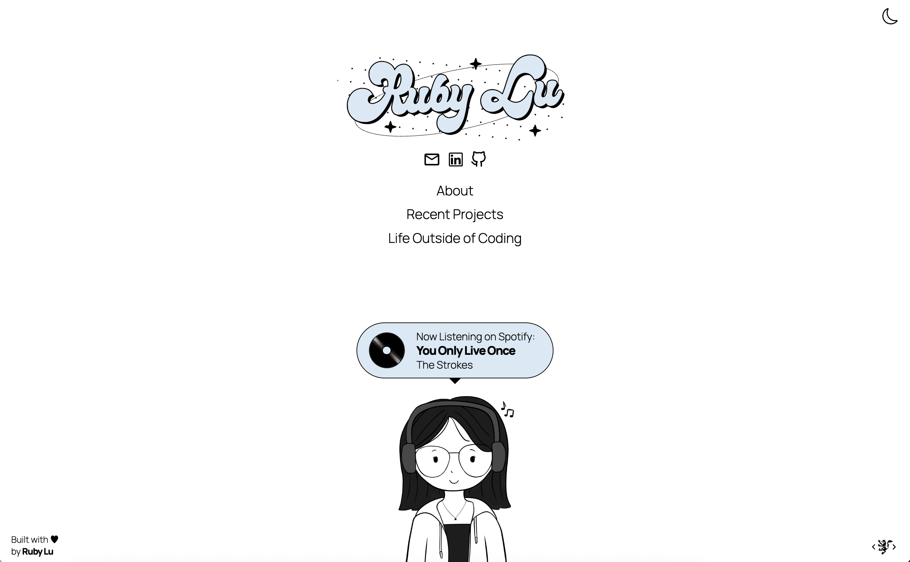

## [rubylu.dev](https://www.rubylu.dev/)

A personal website showcasing my professional history, passion projects, and personal interests.

- **Framework**: Next.js
- **Styling**: Tailwind CSS
- **Deployment**: Vercel
- **APIs & Services Integrated**:
  - Letterboxd RSS feed (for recently watched movie data)
  - Last.fm API (for Spotify listening data)
  - Deezer API (for music artist images)
  - Nodemailer (to email recommendations)
